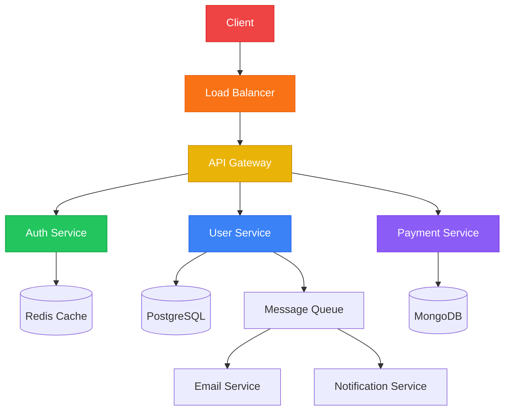

<div align="center">

# 👋 Hey, I'm Divyansh Mishra

### Full Stack Developer | System Design Expert | Problem Solver

[](https://your-portfolio.com)
[](https://linkedin.com/in/divyansh-mishra)
[](mailto:your.email@example.com)


---

### 💡 Architecting Scalable Systems, One Line of Code at a Time

**Building robust applications** • **Designing distributed systems** • **Optimizing performance**

</div>

---

## 🚀 About Me

```javascript
const divyansh = {
    role: "Full Stack Developer",
    expertise: ["System Design", "Scalable Architecture", "Clean Code"],
    location: "India 🇮🇳",
    languages: ["JavaScript", "TypeScript", "Python", "Java"],
    philosophy: "Write code that humans can understand, not just machines",
    currentFocus: "Building high-performance distributed systems",
    availableFor: "Freelance Projects | Full-time Opportunities | System Design Consultations"
};
```

<div align="center">

```ascii
╔═══════════════════════════════════════════════════════════════╗
║  🎯 Specialization: End-to-End Development & System Design    ║
║  💼 Experience: Building Production-Grade Applications        ║
║  🏆 Goal: Creating software that scales and stands the test   ║
╚═══════════════════════════════════════════════════════════════╝
```

</div>

---

## 🛠️ Tech Arsenal

<div align="center">

### 🎨 Frontend Development


### ⚙️ Backend Development


### 🗄️ Databases & Caching


### ☁️ Cloud & DevOps


### 🏗️ System Design & Architecture


</div>

---

## 💼 What I Do Best

<table>
<tr>
<td width="50%" valign="top">

### 🏗️ System Design & Architecture
- Designing scalable distributed systems
- Microservices architecture
- Database schema design & optimization
- API design (REST, GraphQL, gRPC)
- Caching strategies (Redis, CDN)
- Message queues (RabbitMQ, Kafka)
- Load balancing & horizontal scaling

</td>
<td width="50%" valign="top">

### 💻 Full Stack Development
- End-to-end application development
- Responsive & modern UI/UX
- RESTful & GraphQL APIs
- Authentication & Authorization
- Real-time features (WebSockets)
- Payment gateway integration
- Third-party API integrations

</td>
</tr>
<tr>
<td width="50%" valign="top">

### 🚀 Performance Optimization
- Database query optimization
- Frontend bundle optimization
- Lazy loading & code splitting
- Server-side rendering (SSR)
- CDN implementation
- Monitoring & logging (ELK, Grafana)

</td>
<td width="50%" valign="top">

### 🔧 DevOps & CI/CD
- Docker containerization
- Kubernetes orchestration
- CI/CD pipelines (GitHub Actions)
- Infrastructure as Code
- Automated testing & deployment
- Cloud deployment (AWS, Vercel)

</td>
</tr>
</table>

---

## 🎯 System Design Expertise



### 🧠 System Design Patterns I Work With

- **Microservices Architecture** - Service decomposition, API gateway, service mesh
- **Event-Driven Architecture** - Pub/Sub, Event sourcing, CQRS
- **Distributed Systems** - CAP theorem, Consistency patterns, Replication
- **Caching Strategies** - Cache-aside, Write-through, Write-behind
- **Scalability Patterns** - Horizontal scaling, Database sharding, Read replicas
- **High Availability** - Failover, Circuit breaker, Retry mechanisms

---

## 📊 GitHub Analytics

<div align="center">

<a href="https://github.com/coderDIVYANSH1705">
  
</a>

<p></p>

<p></p>

</div>

---

### 📊 Contribution Graph

[](https://github.com/coderDIVYANSH1705)

---


---


---

## 🔥 Recent Activity

<!--START_SECTION:activity-->
<!--END_SECTION:activity-->

---

## 📚 Latest Blog Posts

<!-- BLOG-POST-LIST:START -->
<!-- BLOG-POST-LIST:END -->

---

## 🏆 Achievements & Certifications

<div align="center">

| 🎓 Certification | 🏢 Provider | 📅 Year |
|:---|:---|:---:|
| AWS Certified Solutions Architect | Amazon Web Services | 2024 |
| System Design Masterclass | Educative.io | 2024 |
| Docker & Kubernetes | Udemy | 2023 |

</div>

---


## 🤝 Let's Collaborate!

<div align="center">

### I'm always open to interesting projects and collaborations!

```
📧 Email: your.email@example.com
💼 LinkedIn: linkedin.com/in/divyansh-mishra
🌐 Portfolio: your-portfolio.com
💬 Discord: YourDiscord#1234
```

### 💼 Open For

- 🚀 **Freelance Projects** - Full stack development & system design
- 💻 **Full-time Opportunities** - Senior/Lead developer roles
- 🧠 **Consulting** - System design reviews & architecture planning
- 🎓 **Mentorship** - Helping developers level up their skills
- 🤝 **Open Source** - Contributing to impactful projects

---


**⭐ Don't forget to star the repos you find interesting!**

</div>
